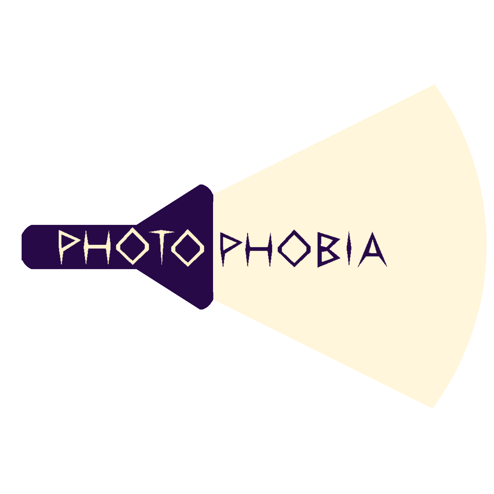
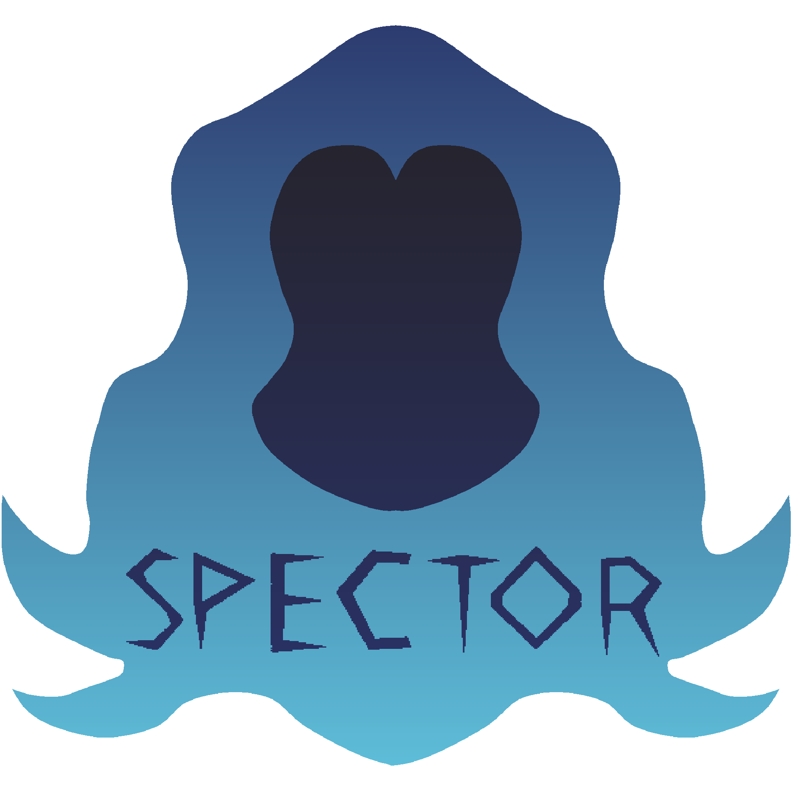

## Overview

Welcome to **Photophobia**, a chilling venture into the dark where light is your most precious resource and often your only perceived ally. Developed as an student project at Full Sail University by Team Spector(Tyson, Jason, Roxanne, Jordan), this game plunges you into a desperate situation; where you struggle for survival within a nightmarish world. You are not a heavily armed soldier, but an ordinary individual who must rely on wits, developing strategies, and the scarce tools you can scavenge to navigate and overcome the terrifying entities being brought to life.

The world of Photophobia is a grim, dark and oppressive environment. Prepare to explore a sprawling, interconnected facility, from desolate, fog-filled industrial halls to other specialized zones, each designed to test your resolve. Every corner turned could lead to a deadly encounter with a variety of horrifying creatures, whose behaviors and interactions are being actively developed to ensure a challenging experience.

---

## Gameplay & Features

Photophobia challenges you to think on your feet, blending elements of strategy, puzzle-solving, horror and Survival.

### Core Gameplay Mechanics (Largely Complete & Functional)

* **Intuitive Player Controls & Core Systems:** The Normal Player Controller is Complete, as somewhat of a Hybrid System blending the Unequiped camControl to be a Swivel on the Body vs when a Weapon is attached, it will function as a normal FPS Controller. A Mostly Diegetic UI for in-game HUD, with only a Crosshair that is togglable. 
* **Basic AI System:** Encounter creatures with established(Somewhat) behavioral patterns. The basic AI is in place, an actively being improved.
* **Inventory & Crafting UI:** Manage your scarce resources and craft essential tools for survival through a developed UI. Both standard inventory and crafting interfaces are complete.

### Immersive Presentation & Atmosphere (Somewhat Complete & Requires Some Polish)

* **Complete Main Menu & Options Menu:** A fully functional main menu allows you to dive into the game, and a Simple options menu lets you tailor your experience.(WIP)
* **Rich Soundscape (SFX & Music):** Slowly Integrating and creating an Immersive Soundscape(WIP)
* **Strategic Lighting & Visuals:** Light plays a crucial role, both aesthetically and mechanically. Initial block assets for levels and characters, along with their lighting, are complete, setting the game's ominous/Horror tone.

### Expanding World & Evolving Threats (In Progress & Nearing Completion)

While the core experience is robust, the world of Photophobia continues to expand with new areas, challenges, and refined assets:

* **Key Environmental Zones Under Development:** Explore a variety of locales, each with its own strategic considerations and dangers. Active development is underway on several key areas:
    * **In Progress:** Relay Hub, Maintenance Shafts, Security Checkpoint, Engineering Bay.
    * **Partially Completed / Pending Peer Review:** Reactor Core, The Lab, Vehicle Depot. These areas are already taking shape, promising diverse environments to survive.
* **Advanced Asset Development:**
    * **Models:** A vast majority of the 3D models that will populate the world and define its characters and creatures are complete, with the remainder undergoing active work.
    * **Traps Assets and Effects:** Expect to encounter devious environmental hazards. The assets and effects for these traps are nearly complete, adding another layer of strategic challenge.

---

## The World

The game unfolds across a series of interconnected, decaying industrial locations and shadowy, undefined zones. Dilapidated factories, eerie warehouses with rows of windows that offer little comfort, and unsettlingly open yet confined spaces form the stage for your desperate bid for survival.

---

## Screenshots

A glimpse into the darkness:

*A fearsome, hound-like creature stalks the shadowy corridors.*
.png)

*A tense encounter with a mysterious, slender figure in a dimly lit, red-hued area.(Alpha Build)*
.png)

*The main menu of Photophobia, inviting players into its gritty, industrial-themed world.(WIP - Lighting doesn't Match Tone)*
.png)

*Facing an overwhelming horde of glowing-eyed entities in the dead of night.*
.png)

*Navigating a dark, multi-level industrial complex with an ominous, glowing central structure.*
.png)

*Peering into the oppressive darkness of a sparse room, where dangers lurk unseen within "The Lab", guided only by a faint red crosshair.(SUBJECT TO CHANGE)*
.png)

*Exploring a decaying Reactor Core*
.png)

*An unsettling outdoor environment under a stark, singular light source, with distant, silhouetted mountains and a lone, faintly lit figure.*
.png)

---

### ⚠️MIND THE DUST THIS IS UNDER CONSTRUCTION ⚠️
